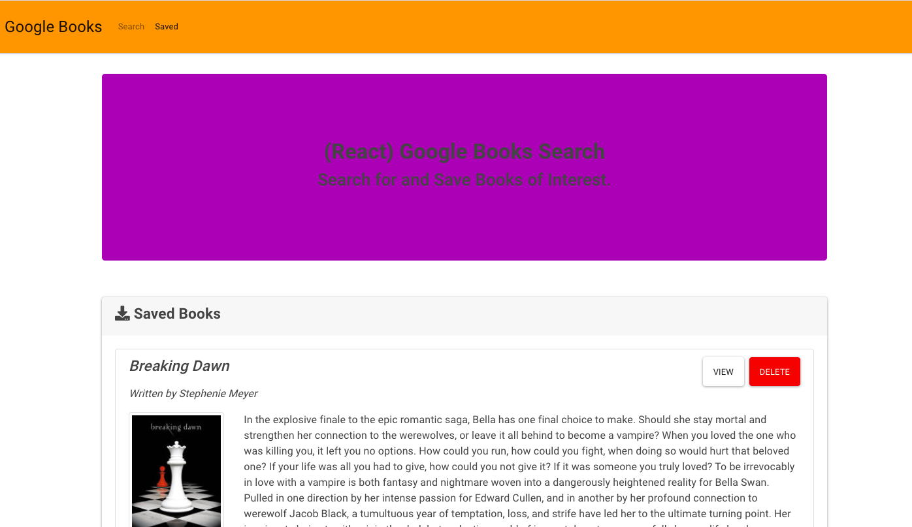

# Google Books Search

### Description

It's a React-based Google Books Search app. It's created with React components, worked with helper/util functions, and utilized React lifecycle methods to query and display books based on user searches. Node, Express and MongoDB are used so that users can save books to review or purchase later.

### User Story

As a user, I am able to search for a book of my intrest.

As a user, I am able to get more information about the book by clicking the links

As a user, I am able to save books to review or purchase later

* The URL of the deployed application:

* The URL of the GitHub repository: https://github.com/Ranjini2020/mern-book-search

